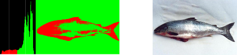

# Symbols, Patterns and Signals

## 1. Introduction

This unit is about using data: generating and interpreting data, and making decisions based on it. What is data? Text, images, video, DNA sequences, emails, web pages, speech, audio, GPS signals, etc.

When comparing different methods, it’s important to consider **what** we need to do (methods), **when** it works (applicability), and **how well** it works (performance). It’s also important to remember to consider why we use it.

### Why is this important? Why do we learn it?

These techniques are fundamental to many different areas of computer science:

- AI, machine learning
- image processing, pattern recognition
- wearable and mobile computing
- graphics, animation, VR
- computer vision and robotics.
- speech and audio processing

And lots of money in data science 😜

### Example: Pattern Classification

**Data**: images of fish

**Aim**: Distinguish between sea bass and salmon

          image
            |
            V
      pre-processing
            |
            V
    feature extraction
            |
            V
      classification
           /   \
          /     \
        └─       ─┘
    sea bass    salmon

#### Possible solution

1. Obtain many example images of salmon, sea bass
2. Determine avg. width and lightness of each image, compute histograms
3. Find the best division point of each, such that the majority of example fish are correctly classified. 1-D linear classification.
4. Plot these metrics in 2-D, and find the best line between the two different regions. Straight line => 2-D linear decision model. Could also use a parabola, hyperbola etc. However, be careful of overfitting with a very wiggly line, as this is likely more down to chance of the data picked than the actual distribution.

### Image segmentation

**Data**: array of pixel values (either colour or greyscale)

**Aim**: identify the regions of different objects in the image

Simplest approach: assume each object is a region of pixels with a similar colour. However, this doesn’t always work:

### Speech recognition

**Data**: samples of analogue speech signals

**Aim**: convert samples into text

Split the sound into phonemes, but then we need to parse the phonemes. This doesn’t work with a simple dictionary, as phonemes don’t always have the same acoustic vectors. But if we use *training data*, we can find the most likely vector for a given phoneme, and then the most likely phonemes to follow a given phoneme.

Therefore we can find the most likely sequence of phonemes given a sequence of acoustic vectors. This is done using Hidden Markov Model and the Viterbi algorithm.

### Spam filter

**Data**: email

**Aim**: determine if it’s spam

Compare relative frequencies of words.

### Others

- ‘Deep learning’ with neural nets

- Autonomous flight