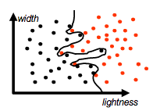

# Symbols, Patterns and Signals

## 6. Deterministic Data Modelling

A model is a description of data. They encode our assumptions about the data, enabling us to design *optimal* algorithms, and compare and contrast methods. All methods invoive an underlying meodel, but it may be implicit. When designing or using a method, it’s important to understand the underlying model.

Models don’t have to describe everything exactly. In some cases, we amy approximate the underlying physical processes, but in others this may be impossible and/or impractical. All we need is a model sufficient to define a method to solve the task. However, the better the model, the more performant the method will be. We choose a model based on how practical it will be to use, as well as on the assumptions we have about our data.

If we only have one dimension, the only option is usually just to choose thresholds for each class. However, when there are more dimensions, there are more possibilities for drawing the decision boundaries. It is a trade-off between complexity of the model and practicality of the method. However, complexity is not always a good thing: overfitting (image below) means the boundary is overly specific for the training data, rather than for the underlying data. In general, a simpler model usually gives good performance, and is more general.

The simplest models are deterministic: they assume that relationships are fixed, and can be predicted over time. They do not allow for randomness or uncertainty, and the solution comes from minumising deviations from the model. This is in contrast to [probabilistic models](A07-probabilistic-modelling.md).

### Least Squares method

E.g. hypothesis that , so we find the best values of  and : minimise the sum of the squares of the vertical offsets (the residual). The smaller the residual, the better the model.This is known as the least squares method.

Alternatively, it can be solved in matrix form:

Need to find . All vectors  can be represented together by a hyperplane. So we set  perpendicular to the hyperplane, i.e. orthogonal to all columns in .

### Polynomial generalisation

What about if we don't believe we have a linear relationship, but rather something else, like a polynomial?

