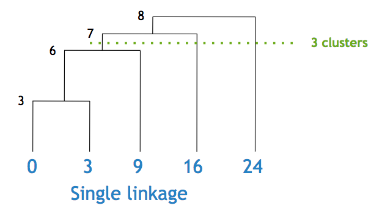
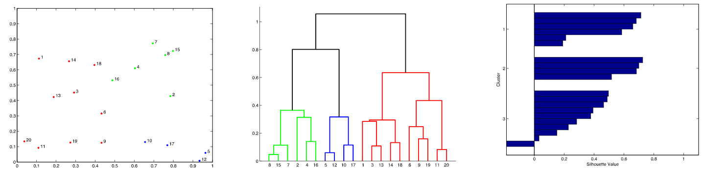

# Symbols, Patterns and Signals

## B5. Hierarchical Clustering

Agglomerative hierarchical clustering: iteratively merging the closest pair of clusters:

- Start off with $n$ points, each in its own cluster. Generate an $n\times n$ matrix $D$ of all pairwise distances, for example Euclidean distances.
- Let $i,j = \arg\min_{ij}D_{ij}$, so $\mathbf x_i$ and $\mathbf x_j$ are the closest pair of clusters.
- Merge $\mathbf x_i$ and $\mathbf x_j$ into a new cluster $\mathbf x^\prime$.
- Recompute the new distance matrix $D^\prime$ (see the [Linkage](#linkage) section).
- Iterate until one cluster remains.
- Output a [dendrogram](#dendrograms).

There is no need to know the number of clusters in advance, as the dendrogram contains information for every level. However, they're not great for efficiency: $\mathcal O(n^3)$ to $\mathcal O(n^2\log n)$. The algorithm also has no preprocessing, so all the processing has to be repeated for any change in input set.

### Linkage

There are different ways to determine the distance between two clusters:

- **Single linkage**: the minimum distance of a pair from each cluster
- **Complete linkage**: the maximum distance of a pair from each cluster
- **Average linkage**: the average distance of all pairs from each cluster
- **Centroid linkage**: the distance between the centroid of each cluster

### Dendrograms

A dendrogram is a tree where each node represents a merge of two clusters. Each node has a height, representing the distance between the clusters. The tree can then be cut at the desired number of clusters.

  
An example of clustering one-dimensional data, using single linkage. The nodes are labelled with their heights.

### Silhouettes

$a(x)$ is the average distance from a point to others in its cluster. $b(x)$ is the average distance from a point to others in the nearest cluster.

The silhouette $s(x) = \left.b(x)-a(x)\middle/\max(a(x),b(x))\right.$ should be large.

Here, the rapidly decreasing silhouette values show that the clusters are not very strong. The negative value of one of the points shows that is has been grouped in the wrong cluster: it is on average closer to the points in the nearest cluster than those in its own.