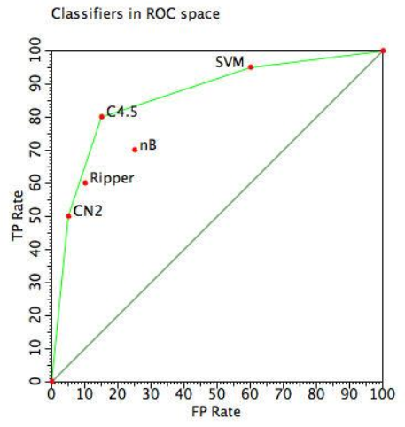

# Symbols, Patterns and Signals

## B7. Evaluating classifiers

When classifying with two classes, there are four possible responses: true positives, true negatives, false positives and false negatives.

Normally classifiers are evaluated by running $n$ tests, and finding the proportion of mistakes $\left(\frac{FP+FN}{n}\right)$. However, this assumes that positives and negatives are equally important. The profit of an extra true positive = the profit of an extra true negative = $1/n$, and the cost of an extra false positive = the cost of an extra false negative = $-1/n$.

This is often not the case. In a medical diagnosis, the cost of mistakenly classing someone as healthy (false negative) is often much higher than a false positive. In spam filtering, it is more important that every non-spam email gets through than that every spam email is filtered out.

The true positive rate (TPR) is the proportion of positives correctly reported, whereas the false positive rate (FPR) is the proportion of negatives incorrectly reported.

**ROC** (formerly Receiver Operating Characteristic) graphs plot the true positive against false positive rates. In the example below, A is a decent classifier. C is wrong more than it is right, so negating all its answers (Cʹ) produces a more accurate result. B gives identical results to guessing, with a 3:1 bias to positive. The perfect classifier would be in the top left: 100% true positives, and 0% false positives.

If the profit of extra true positives and of extra true negatives are equal, then any point on a line with a slope 1 (such as any point on the red dotted line) is as good as any other. More generally, if the cost ratio $c$ (cost of false positive vs cost of false negative) is high, then a low FPR is more important than a high TPR, and vice-versa. All points on a line with slope $c$ are equally as good.

  
The classifiers form a “convex hull”. All classifiers under this hull are suboptimal. To obtain a classifier midway between two classifiers on this hull, randomly combine the results.

### AUC metric

If we have a classifier, it will appear as one point on an ROC graph. If we try to change the decision threshold many times and plot each result on an ROC graph, we should hopefully get a convex hull. We can evaluate the classifier by measuring the area under the curve (AUC) of the ROC graph. The higher the AUC the better.